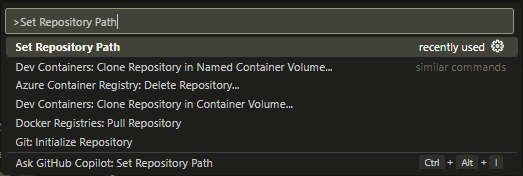
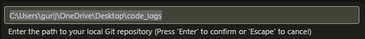

We all know how Github poorly tracks the progress of our programming time and people actually care about the Github contribution graph.

**AutoGit** is a VS Code extension that rightfully track your progress and log the `pwd` and present working file into a `README.md` file in a new repo only when a file change is detected every 30 minutes.


## Features
- Automatically tracks changes (creation, modification, deletion) in your workspace.
- Appends the logs to a `README.md` in your Git repository.
- Displays motivational quotes when no changes are detected.


## Setup

### Prerequisites
- Git must be installed and configured on your system.
- A local Git repository must exist for tracking changes.
- Visual Studio Code must be installed.


### Setting the Repository Path
1. Open the Command Palette (`Ctrl+Shift+P` or `Cmd+Shift+P` on macOS).
2. Search for the command `AutoGit: Set Repository Path`.
   
3. Enter the absolute path of your local Git repository.
   
   

That's it you are good to go!!!


## Contributing
We welcome contributions from the community! Here's how you can help:

1. Fork this repository.
2. Create a new branch for your feature or bug fix:
   ```bash
   git checkout -b feature-name
   ```
3. Commit your changes:
   ```bash
   git commit -m "Describe your changes"
   ```
4. Push the branch to your fork:
   ```bash
   git push origin feature-name
   ```
5. Open a pull request with a detailed description of your changes.


## License

This project is licensed under the [Apache License](LICENSE).


## Acknowledgments
- [Visual Studio Code Extension API Documentation](https://code.visualstudio.com/api)
- The coding quotes included in the extension were inspired by developer culture and humor(Contribute some as I am bad and lazy at finding these).

